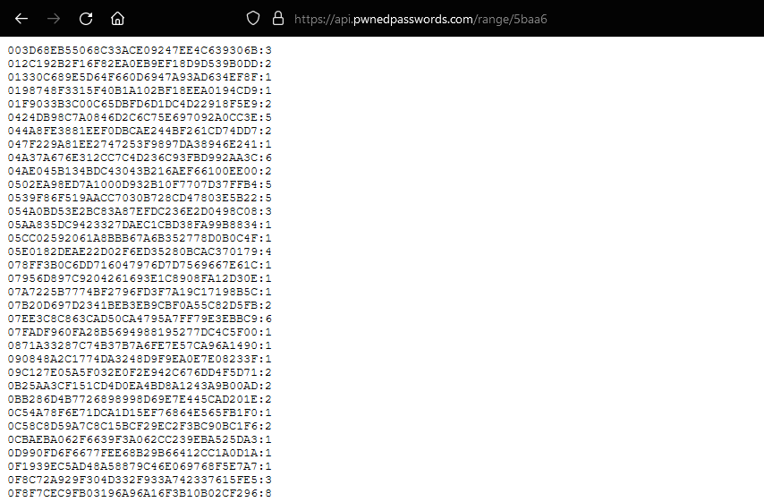
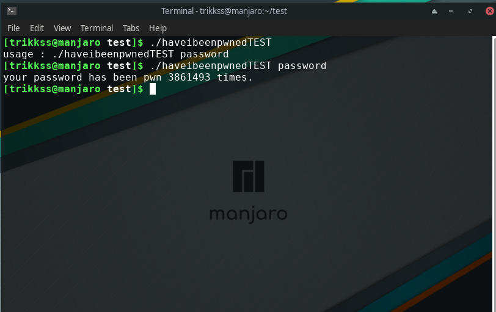

# **GOLANG PACKAGE FOR THE HAVEIBEENPWN API**

### **HOW THE API WORKS**

first we need to hash your password in sha1 and get the 5 first characters of this hash.
second, we need to send this 5 characters to the haveibeenpwn api at this address : https://api.pwnedpasswords.com/range/{{your_five_characters_here}} and the server will return us a list of all hashed passwords starting with these 5 same characters and how many times they have been pwn.

***example :*** 

password *=SHA1=>* 5baa61e4c9b93f3f0682250b6cf8331b7ee68fd8

first five characters = 5baa6

we send this : https://api.pwnedpasswords.com/range/5baa6



now, we need to find your string without the five first characters in the list of hashed passwords.

on your browser : ctrl + f and search this string 1e4c9b93f3f0682250b6cf8331b7ee68fd8 (the end of the password hash)


here you can see the password password has been pwn 3861493 times.

this API is very clever because your password or its hash is never sent in clear.

### **INSTALLATION**

```
go get github.com/TRIKKSS/haveibeenpwnedpkg
```

### **USAGE OF MY PACKAGE**

```go
import "github.com/TRIKKSS/haveibeenpwnedpkg"

haveibeenpwnpkg.HaveibeenpwnPassword("password") // return how many times the password has been pwn and errors
```

### **EXAMPLE**

```go
package main 

import(
    "github.com/TRIKKSS/haveibeenpwnedpkg"
    "fmt"
    "os"
)
func main() {
    if len(os.Args) != 2 {
        fmt.Printf("usage : %s password", os.Args[0])
        os.Exit(1)
    }
    how, err := haveibeenpwnpkg.HaveibeenpwnPassword(os.Args[1]/*your password*/) 

    if err != nil {
        /* check errors */
        panic(err)
    }
    if how > 0{
        fmt.Println("your password has been pwn " + how + " times.")
    } else {
        fmt.Println("password safe.")
    }
}
```
test of the above script : 


